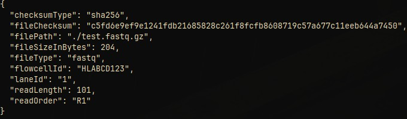

# FASTQ tools

Application to show information about and scramble FASTQ files to provide non-sensitive data for development purposes

## Usage

This application provides the following subcommands

```
Usage: fastq-tools [OPTIONS] <COMMAND>

Commands:
  info          Show information about input
  grz-metadata  Show GRZ metadata
  scramble      Scramble input data
  help          Print this message or the help of the given subcommand(s)

Options:
  -i, --input <INPUT_FILE>  Input file
  -d, --decompress          Decompress input as gzip compressed data
  -h, --help                Print help
  -V, --version             Print version
```

### Info

To show information about compressed FASTQ files use:

```shell
cat file_fastq.gz | gzip -d | fastq-tools info
```

To use build-in decompression of input data, use the `--decompress`/`-d` option:

```shell
cat file_fastq.gz | fastq-tools --decompress info
```
Using optional input file argument:

```shell
fastq-tools --decompress --input file_fastq.gz info
```

This will result in output like


### GRZ Metadata

To generate GRZ metadata for a file use:

```shell
fastq-tools --decompress --input file_fastq.gz grz-metadata
```

The use of the `--input` argument is required for this sub command.
If the file is an uncompressed FASTQ file, you can omit the `--decompress` option.



Supported file types are:

* fastq (full support)
* bam, bed, vcf (limited support)

### Scramble

To scramble compressed FASTQ files use:

```shell
cat file_fastq.gz | gzip -d | fastq-tools scramble | gzip > scrambled_fastq.gz
```

This will scramble headers and sequences and write the output into `scrambled_fastq.gz`.

To use build-in decompression of input data, use the `--decompress`/`-d` option:

```shell
cat file_fastq.gz | fastq-tools -d scramble | gzip > scrambled_fastq.gz
```

Using optional input file argument:

```shell
fastq-tools -d -i file_fastq.gz scramble | gzip > scrambled_fastq.gz
```