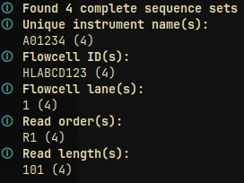

# FASTQ tools

Application to show information about and scramble FASTQ files to provide non-sensitive data for development purposes

## Usage

This application provides the following subcommands

```
Usage: fastq-tools [OPTIONS] <COMMAND>

Commands:
  info      Show information about input
  scramble  Scramble input data
  help      Print this message or the help of the given subcommand(s)

Options:
  -d, --decompress  decompress input as gzip compressed data
  -h, --help        Print help
  -V, --version     Print version
```

### Info

To show information about compressed FASTQ files use:

```shell
cat file_fastq.gz | gzip -d | fastq-tools info
```

To use build-in decompression of input data, use the `--decompress`/`-d` option:

```shell
cat file_fastq.gz | fastq-tools --decompress info
```

This will result in output like



### Scramble

To scramble compressed FASTQ files use:

```shell
cat file_fastq.gz | gzip -d | fastq-tools scramble | gzip > scrambled_fastq.gz
```

This will scramble headers and sequences and write the output into `scrambled_fastq.gz`.

To use build-in decompression of input data, use the `--decompress`/`-d` option:

```shell
cat file_fastq.gz | fastq-tools -d scramble | gzip > scrambled_fastq.gz
```